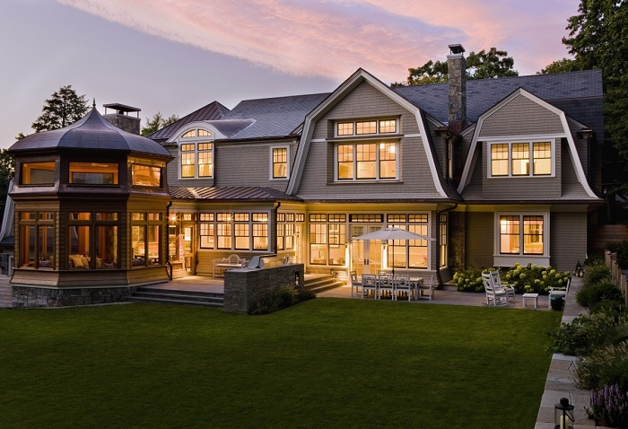
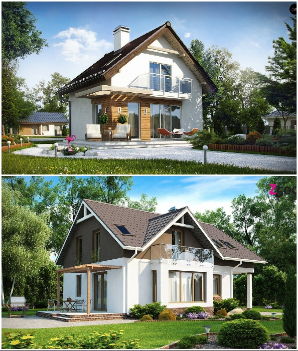
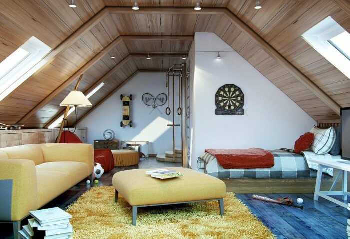
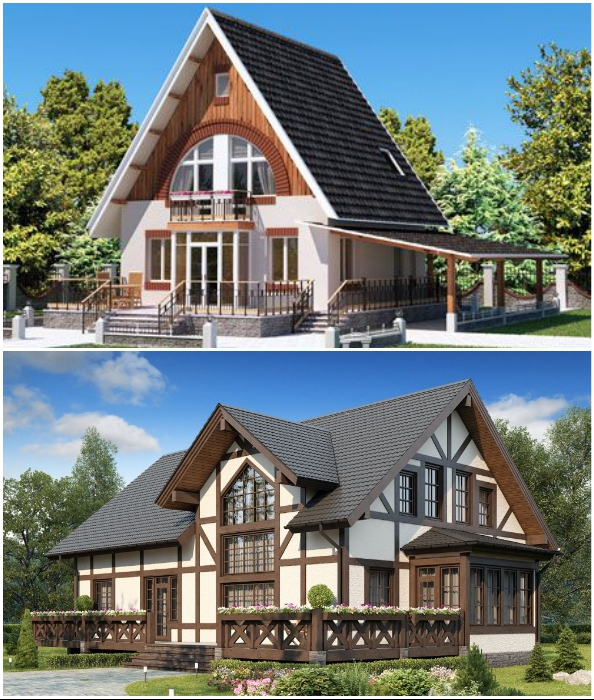

# The attic in the house: the advantages and disadvantages of creating a living space in the attic

When building a house, future owners are often faced with a choice - whether to increase usable space through the use of attic space or to prefer a full-fledged second floor. Each of these options has its advantages and disadvantages. Admirers of the attic argue that there are more advantages in the development of the attic and it is better to prefer this option. But is it so romantic to have windows in the roof and whether it is reasonable to inhabit the "truncated" space?

## What is an attic and who were the first to inhabit the attic space?

To begin with, we need to determine what an attic is, and whether the homeowner will benefit from the use of this space. Building codes (SP 54.13330.2011) reads: "Mansard - floor in the attic space, the facade is fully or partially formed by the surface (surfaces) of sloping or broken roof, and the line of intersection of the plane of the roof and the facade must be at a height of not more than 1.5 meters from the floor attic floor. In addition to SNiPs there are also sanitary norms that regulate the height of ceilings: "In each dwelling in the attic, the ceiling height must be at least 2.5 m, but not more than 50% of its area.

## Advantages of an attic

- Economy. Experts say: the greater the surface of the frame walls created from the rafters, the more you can save. Since the amount of material for the outer skin decreases, and there is no need for additional insulation (if sufficiently insulated under-roof surface). True, it will have to give up using as a living area of a large area. If, however, compared to the construction of a single-story house, the percentage of savings increases by reducing the area of the house. And this means that you can save money on creating an expensive foundation and the cost per square meter of land.

- Flexibility of layout. If the house is planned to live in several generations, but the creation of a full floor is not in the plans of homeowners, the additional space of the attic is very helpful for arrangement of sleeping rooms for children, studies or play areas.

- Ideal illumination (if not stingy). Modern projects provide a lot of options for the introduction of window openings, ranging from the ends of the house and ending with windows on a sloping roof. The only thing for their installation will need to complicate the shape of the roof, and fasten roof windows is much harder. Although all this is compensated by the opening possibility to provide living areas with natural light. Thanks to this in the attic can be arranged beautiful children's rooms, comfortable offices, and even romantic bathrooms with a window on the ceiling (thanks to the passage of communications now no problem).

